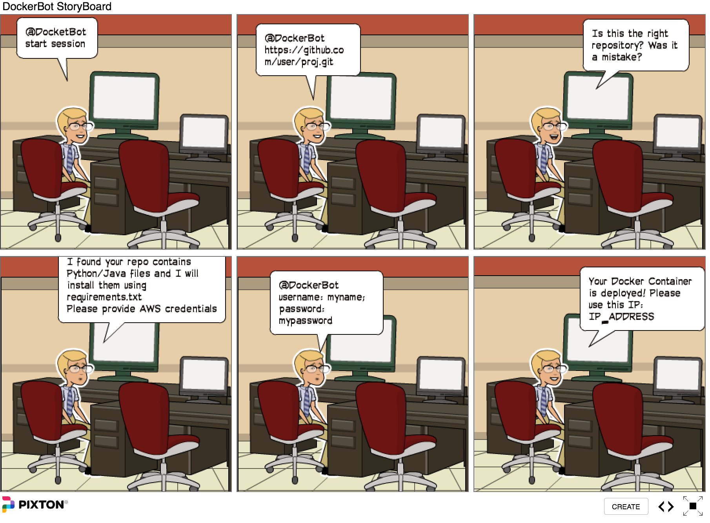
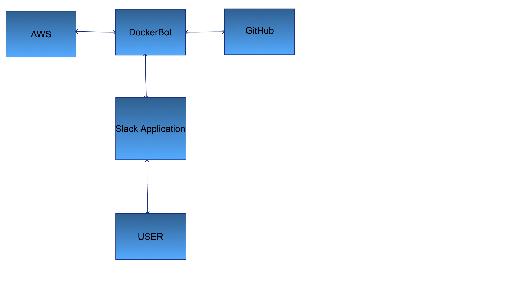

# Design Milestone

## Team Members:
|Member Name|Unity ID|
|:---------:|:------:|
|Aditya Bhardwaj|abhardw2|
|Atul Kumar|akumar22|
|Bharath Bangalore Veeranna|bbangla|
|Karan Chaudhary|krchaudh|
|Rakshit Holkal Ravishankar|rhravish|

## Problem Statement (15%)
Porting applications to platforms can be difficult due to various dependencies that are required to run the application. This led to the introduction of Docker. It lets you put your environment and configuration into an image and deploy it. The same Docker configuration can then be used in a variety of environments. This decouples infrastructure requirements from the application environment. Our project involves creating a **Docker Bot**. The bot targets the core problem faced by IT users who are not well acquainted with the task of creating Docker images files. 

## Bot Description (10%)
Our Bot will primarily interact with the user via ‘Slack’ and get minimal information from user, like the link to github repository. Our bot will clone the user repo and will search for requirements.txt file. This file contains all the dependencies needed to compile the user application. Bot shall then try to create a Dockerfile based on the requirements. Docker bot will deploy the newly created image to AWS container service and then bot will return various information like IP address in order to make deployed containerized webapp accessible to user.

The Bot would would interact with the user and inform about events like  “github repo parsed” , “ requirements detected “, “AWS credentials valid/invalid” and “docker image created”.  User can also interact with our bot with messages like “My code is in the link ….”, “version number desired”, “Delete the Docker container” etc.  The bot can concurrently respond to multiple user requests and would create unique docker images for them.

Since our Docker Bot helps managing the infrastructure deployment issues, it can be categorised as a DevOps bot.

## Use Cases (15%)
### Use Case 1: User provides link to his/her Github repository to the bot. Bot creates a Docker file based on the dependencies. 
#### 1. Precondition
	* User/Application developer should have the code in a Github Link.

#### 2. Main Flow
	* User/Application developer will request the bot to create docker file. [S2]
	* User/Application developer will provide the Github link and the requirements text. This will be parsed by the Bot to understand the requirements. [S3]

#### 3. Subflows
	[S1] User provides the Github link to the bot.
	[S2] Bot looks for 'requirements.txt' file in the Github link.
	[S5] Bot creates a docker file based on the contents of 'requirements.txt' file.

#### 4. Alternative Flows
	[E1] The Github link provided by the user is invalid.
	[E2] There is no requirements text file in the Github link.

### Use Case 2: User can interact with the bot to specify any additional dependencies of his application.     
#### 1.Precondition  
      * This additional requirement should be specified before the creation of Docker file.  

#### 2.Main Flow  
      * After providing the Github link, user can specify additional dependencies of his application. These dependencies will be added to the Docker file.  
      
#### 3. Subflows  
	[S1] Bot asks the user if there are any additional dependencies for the application.  
	[S2] User provides additional dependencies to the bot.  
	[S3] Bot merges the new dependencies to the old requriements and creates the docker file.  

#### 4.  Alternative Flows  
	[E1] User doesn't have any additional dependencies.    

### Use Case 3: Bot deploys the docker image on AWS and returns the IP address of the AWS instance back to the user.
#### 1. Precondition
        User should have valid AWS credentials.

#### 2.  Main Flow
	 * User/Application developer will request the bot to create docker file. [S2]
	 * User/Application developer will provide the Github link with the requirements text file, which will be parsed by the Bot to understand the requirements. [S3]
	 * Bot will request AWS credentials from the user. User provides valid AWS credentials to the bot.

#### 3. Subflows
	[S1] Bot deploys the docker image on AWS. 
	[S2] Bot would notify the users with the details of the IP address of AWS container.

#### 4. Alternative flows
	[E1] AWS credentials provided by the user  is invalid.
	[E2] Docker image could not be deployed on AWS.

## Design Sketches (30%)  

### WireFrame  

**The Wireframe GIF below contains one flow for confirm button click**

[**Online Link to the Wireframe demo**](http://bit.ly/2fGdfEB)

[**The Wireframe GIF Online link for No button click**](http://bit.ly/2jRm1UQ)

### StoryBoard for the Application 

**[Online Link to the Storyboard of the Bot](https://Pixton.com/ic:69kbxj1l)**

## Architecture Design + Additional Patterns (30%)  

### Architectural components   
#### Slack  
We are using slack as the communication channel between the user and the bot. Any input to the bot or notification regarding the output from the bot will be communicated through slack channel. 

#### Github  
The bot would pull the code from github to deploy onto the docker image. The Github repo would have a requirement.txt file which will explicitly mentioned all dependencies needed for the application to run.

#### AWS  
AWS would provide us container infra to host our Docker image. The bot would authenticate into the AWS service with the credentials provided by the user. 

#### Docker container  
The final output from the bot will be a docker image. The bot will create a docker image, start a docker on AWS and return the IP address of the container deployed.

#### Bot server  
Bot server runs on a linux environment. Bot is the brain of our design which parses the code from Github and decides the environment used in the code. Depending on this decision, a docker file is created with all required dependencies. Bot will later fetch the AWS credentials from the user and tries to create a docker container based on the docker file created earlier.

#### Third party services used   
AWS for deploying containers.
Slack as an interface between the user and the bot.

#### Embedded platform  
Bot runs on a Linux environment. The code for Bot will be developed in nodejs.

#### Architecture Constraints  
Docker bot will only work if the code has to be deployed on Github. 
Docker bot currently supports only Python repos.
User has to deploy his/her docker containers only on AWS. User is not given a choice to deploy docker containers on other cloud platforms.
User will have limited control over Docker file creation. User will not be able to use advanced features like multi-stage builds etc.

#### Additional Patterns
##### Observer Pattern
Observer pattern is used when we want certain objects in a system to be notified about changes in state. In the observer pattern, an object called the subject maintains a list of the its dependents, called observers, and notifies them automatically of any state changes. We will be using the observer pattern to model the events being passed around our system. In our case the observer will be our bot, which is interested in the state changes. The bot will observe changes in state from various sources like AWS, github, will react to the changes and notify the user.

